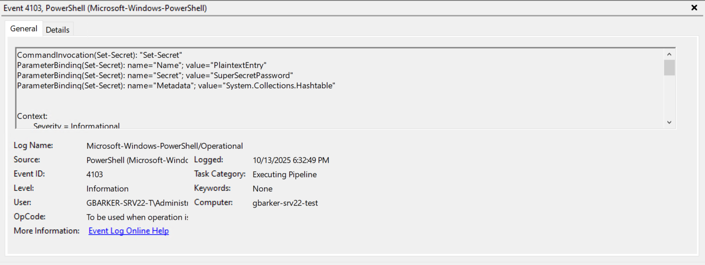
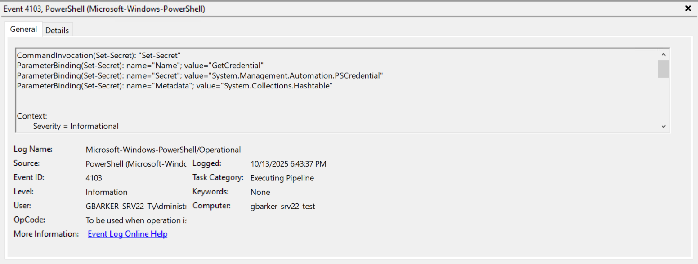
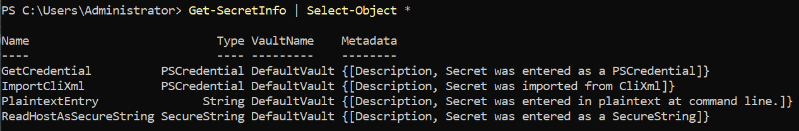

# Introduction
Users of PowerShell may have encountered or make use of the SecretManagement and SecretStore modules to securely handle their passwords, API keys, and other sensitive secrets both for daily use as well as unattended automations. After all, you wouldn't hard-code a credential into a script, right? ...right?

That's a great practice and all, but to retrieve a securely stored secret, you need to actually store it first! That means providing the secret to your SecureStore for storage. Many people will follow the [Get started with the SecretStore module - PowerShell | Microsoft Learn](https://learn.microsoft.com/en-us/powershell/utility-modules/secretmanagement/get-started/using-secretstore?view=ps-modules) article. This is good, but there's an important catch that needs to be understood. 

**What you enter at the command line has the potential to be logged.**  

Many enterprise environments--especially those adhering to CIS benchmarks or other security standards--will have PowerShell ScriptBlock logging enabled. Such features can lead to administrators inadvertently leaking passwords or API keys in plaintext, which are then stored unencrypted.

So let's have a look at some of the options for entering secrets into your SecureStore! All of the examples in this article will assume PowerShell Script Block Logging is enabled, and that you have the aforementioned modules installed with a DefaultVault configured.

# Methods

## Entering a String ("Quotes" or 'Quotes')
This is the method demonstrated in the aforementioned getting started article. You simply give the secret a name and type in the secret.

```powershell
Set-Secret `
    -Name 'PlaintextEntry' `
    -Secret 'SuperSecretPassword'
```

Here is what the corresponding event log entry looks like if you do this:  


See how the event log itself shows the secret's value, "SuperSecretPassword" in plain text? That's a problem! So what are some better options?

## Entering a SecureString (Read-Host -AsSecureString)
Instead of providing a String for the -Secret parameter, let's provide a SecureString.

```powershell
Set-Secret `
    -Name 'ReadHostAsSecureString' `
    -Secret (Read-Host -AsSecureString)
```

Here is what the corresponding event log entry looks like if you do this:


Notice how the event log itself no longer shows the secret's value? This is great! We do have other options available to us as well.

## Entering a PSCredential (Get-Credential)
Need to store both a username and a password together (or really any other sensitive key-pair value)? We can use Get-Credential to provide the secret value without leaking plaintext secrets.

```powershell
Set-Secret `
    -Name 'GetCredential' `
    -Secret (Get-Credential)
```

Running this will result in a prompt to provide a username and password. Here is what the corresponding event log entry looks like if you do this:


Again, we see that the secret is not revealed in plain text in the log. Excellent!

## Importing CliXml (Import-CliXml)
The Export-CliXml and Import-CliXml cmdlets have been around for a good while, and many administrators use these to securely store secrets on the filesystem. If you're wanting to migrate these into a SecretStore, you're all set!

```powershell
Set-Secret `
    -Name 'ImportCliXml' `
    -Secret (Import-CliXml -Path $env:LOCALAPPDATA\secrets\sample_clixml)
```

The CliXml file will be imported securely and set the secret value without leaking the secret in plain text:


Just as with the other two secure examples, we're in the clear (but not cleartext thankfully).

# Wrapping Up

There we have it! We demonstrated why it is important to be careful when entering secrets in your SecretStore.


## Notes  
> ℹ️ *If your environment has Protected Logging enabled, sensitive data that is logged is encrypted. It's recommended to have this enabled if you have Script Block logging enabled. Even with Protected Logging enabled, there's nothing wrong with building good habits and command line hygiene!*

> ⚠️ *If you are using Start-Transcript and Stop-Transcript or another method to capture the output a script, be mindful that if you use the Get-Secret cmdlet with the -AsPlainText parameter, the secret could be logged and leaked. Be mindful of how you access your secrets and where possible, do not retrieve them as plain text.*
>

> ✅ *In the code block examples, the parameters are split across lines using the grave ` symbol. This was a conscious decision to better mimic how a reader might type it in at the command line. When writing scripts, please be sure to use splatting instead.*  